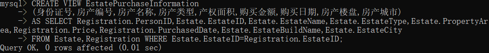

# 开始啦！

## 新的发现
随着对markdown了解的深入，我知道了这不是一个软件，而是一种文本标记语言。   
同时也对VScode有了进一步的认识。之前我以为VScode是像vs一样，是用来写代码的。现在我知道了，它并不是IDE，它可以用来做很多事情。（好像还可以做ppt？


## 开始探索！
### #3 Linux / WSL
#### step1. 了解WSL！
简单粗暴的方法：直接在Bing中搜索“WSL”。
发现了安装路径：

****
一些碎碎念：原来粘贴图片需要CTRL+ALT+V
(刚刚输入加号时不小心把SHIFT键按成了CTRL，于是我发现按CTRL+加号（减号）可以放大（缩小）视图)

****
点进去之后，发现不仅有比较详细的安装教程，还有wsl的详细介绍：
>适用于 Linux 的 Windows 子系统可让开发人员按原样运行 GNU/Linux 环境 - 包括大多数命令行工具、实用工具和应用程序 - 且不会产生传统虚拟机或双启动设置开销。

并且是我需要的：
>默认情况下，安装的 Linux 分发版为 Ubuntu。
#### step2. 准备完毕，开始安装！:laughing:
&emsp;**第一个问题**出现了!
&emsp;&emsp;首先要在 *Windows命令提示符* 中输入安装WSL命令，可我不知道 *Windows命令提示符* 在哪里打开。
于是我迅速百度，得到了5种打开它的方法。我选择了如下方法：
>从 运行 框中打开命令提示符。只需按 Windows 键 + R 打开"运行"。键入cmd，然后按 Enter 键。这将打开没有管理员权限的命令提示符。

&emsp;**第二个问题**也来了！（解决后回顾：是个小问题
&emsp;&emsp;我这样操作了，但行不通:cry:显示如下图：

&emsp;&emsp;于是，我在*搜索* 中输入“命令提示符”，发现了它：

我这才发现我一开始选择的方法是没有管理员权限的。（果然下次获取信息的时候应该把整句话读完）然后我点击它，输入了教程里提供的命令。这次成功了！
*现在是等待时间...*
&emsp;在重启、设置用户名和密码之后，我需要检查一下我下载的WSL的版本：

确认过之后，我就要开始下一步了！
*****
一个题外话：之前觉得这些操作好高深好难，但真正一步步实践下来，从发现问题到解决问题的过程，逐渐感觉蛮有意思的。
*****
#### step.3 连接VS Code！
&emsp;依然是按照之前找到的教程（它真的很全面
&emsp;我已经下载好了VS Code（现在正在用），所以我的第一步是*安装远程开发拓展包* 。教程里有链接，直接点击就可以下载。
&emsp;下载完成后，我需要 *在 ==VS Code== 中打开 WSL 项目*。
&emsp;有两种方式，我选择 *从==命令行==中打开*。
·打开命令行，然后输入==code .== 如下图所示：

·安装好之后，在VS Code中选择“信任..."就好啦：

#### step.4 配置基于 SSH 密钥的免密的远程服务器登陆
&emsp;我对这个不太懂，于是我在CSDN论坛上搜索了一下，找到了教程。
&emsp;第一步：*生成密钥*

&emsp;第二步：*将公钥匙上传到了服务器的家目录下的.ssh文件夹下的authorized_keys这个文件中*

&emsp;第三步：*免密登陆测试*


在最后的环节出现了**问题**：两种输入都显示连接超时:sob:
我又搜了搜，在CSDN论坛上找到了一篇针对这个问题的解决方案。
&emsp;第一步： *查看文件*

&emsp;确认有这样一个文件夹
&emsp;第二步： *进入.ssh*

&emsp;这里需要找到一个名为authorized_keys的文件，但我没有这个文件。所以在解决问题的过程中又多了一个问题:persevere:。
&emsp;&emsp;我又又又在CSDN论坛上找到了缺少authorized_keys文件的解决方法。
&emsp;&emsp;创建好之后，需要找到id_rsa。然而我没有。我突然意识到了问题的严重性，决定从头开始。。
&emsp;第三步： *从头开始*
我陷入了一种循环：发现问题->解决问题->发现新的问题
我的操作包括但不限于：（有些没来得及记录，有些重复的操作也没有记录）


修改权限

虽然做了很多操作，但并没有成功:disappointed:，最后附上一张我整理的：

#### step.5 开发出简易的Shell小程序！ 
&emsp;**第一步**， 需要了解一下Shell——在哪里写？怎样运行？语法？
看了CSDN上找到了详细的介绍后，我准备试一试！（大致看了一下，感觉和c语言有些相似
&emsp;**第二步**，我打算写个日历:smile:
&emsp;**第三步**，开始写程序啦！（先写个hello world


后来我又修改了一下

但不知道为什么，while循环就是不会执行（修改之前是第三个if语句不执行
在尝试了无数次之后，我只好写成这种简单粗暴的：


总算是对了

### #9 数据库
#### SQL是什么？
>SQL 是一种操作数据库的语言，包括创建数据库、删除数据库、查询记录、修改记录、添加字段等。SQL 虽然是一种被 ANSI 标准化的语言，但是它有很多不同的实现版本。
#### 下载并配置数据库
##### 1.了解数据库
>MySQL 是一种开源的 SQL 数据库，由瑞典的 MySQL AB 公司开发。MySQL 支持多线程、多用户，并且非常快速，一般的中小型网站都选择 MySQL（C语言中文网也基于 MySQL 数据库部署）。

我选择用MySQL来完成这本题。
##### 2.下载数据库
经过一些比对，我选择了CSDN上的一篇教程。
**第一步** **安装MySQL**
教程中有两种方法：用MySQL官网提供的两种安装方式（在线版联网安装和离线安装）安装，以及下载压缩包来安装。
为了避免一些可能会出现的错误，我选择下载压缩包。
在我点击教程中给出的链接后，跳转到了如下页面：

我需要点击上图右下角的Download按钮安装。

出现了如下界面。我点击了下方蓝色小字，压缩包开始下载。

下载完成后，用Bandizip解压。

**第二步** **配置环境**
打开系统环境变量：右键单击开始→设置→系统→系统信息→高级系统设置→环境变量→点击系统变量下的：
粘贴MySQL安装的bin文件目录的路径：![]
打开mysql-8.0.30-winx64文件夹，新建一个后缀名为 .ini 的 my.ini空白文件。

初始化数据库，将教程中的内容粘贴到 my.ini中：
进入本地命令行窗口，通过命令行进入mysql下的bin文件夹：
在输入初始化数据库的命令：
报错了，原因应该是我直接粘贴了模板，这次我按照自己的情况更改了一下：
再尝试之前的操作，操作成功，菜单里多了一个文件夹：
现在本应在data文件夹里出现一个后缀为.err的文件，但我没有，于是又多看了几个教程，准备删除data文件夹，重新试一试。
按照另一个模板更改了my.ini文件：

操作成功，右下角即为生成的随机密码&emsp;*)(d_oRs0jO4z* ：


**第三步** **安装mysql服务并启动MySQL服务**
在命令行中输入命令：
安装：
启动:

将mysql改为手动启动：右键此电脑→管理→服务与应用程序→服务


**第四步** **安装Navicat和Wampserver**
朋友给我发了安装包，我已经下载好了.exe文件,现在要开始安装啦。
双击文件，然后保持默认设定，最后等待下载。
 

连接MySQL：

输入连接名和密码：

测试连接：（报错了:cry:

****
开始解决问题：
1.查看端口占用情况

2.找到3306：

3.去任务管理器关闭对应的PID对应的进程:
(忘记截图了
再次尝试，又报错：

查了一下，错因应该是没有数据库没有在运行（因为我刚刚把它关了，于是我尝试在bin目录下启动mysql：

这次连接成功了！

****
右键单击mysql80，点击打开连接，查看数据库：

设置完新密码之后就连接成功啦：

#### 编写SQL语句！
***
ps:我把编写和运行分开了，运行时报错的代码我更改之后又添加到了这里。
***
首先需要系统地了解SQL语句，我在CSDN上找到了一篇比较全面的[教程](https://blog.csdn.net/weixin_45851945/article/details/114287877)
点击新建查询，开始编写SQL语句。
**(1)创建数据库EstateDB。**


忘记打分号了 
**(2)在数据库EstateDB中创建上述3个数据库表， 并定义其 *完整性约束* 。**
**→什么是完整性约束？**
>完整性约束（integrity constraint）保证授权用户对数据库所做的修改不会导致数据一致性的丢失。因此， 完整性约束防止的是对数据库的意外破坏。完整性约束通常被视为数据库模式设计过程的一部分，并作为用于创建关系的create table命令的一部分被声明。

**→创建数据表的语法**：
> 
>主键加 “primary key”
****
突然发现Notepad++中可以选择SQL语句

所以我打算改成在这里写。
****
**→外键**
>

**→MySQL支持的数据类型**
写到这里发现好像不支持money类型：
 
于是我搜索了一下MySQL支持的数据类型：

那么用什么来代替money？
我找到了一篇[讲解](https://blog.csdn.net/weixin_40001924/article/details/113118195?spm=1001.2101.3001.6650.5&utm_medium=distribute.pc_relevant.none-task-blog-2%7Edefault%7EBlogCommendFromBaidu%7ERate-5-113118195-blog-84964922.t5_refersearch_landing&depth_1-utm_source=distribute.pc_relevant.none-task-blog-2%7Edefault%7EBlogCommendFromBaidu%7ERate-5-113118195-blog-84964922.t5_refersearch_landing&utm_relevant_index=8)
我进行了简单总结：可供选择的有 float/double/decimal 三种类型，float/double在存储浮点数时，会将其转化为二进制小数，在这个过程中可能会发生 *==精度的丢失==* 。
>以0.3为例：0.3 x 2=0.6 → 0  &emsp;&emsp;&emsp;&emsp;&emsp;小数部分会出现无限循环，而计算机只会存储有限位数
&emsp;&emsp;&emsp;&emsp;&emsp;0.6 x 2=1.2 → 1  &emsp;&emsp;&emsp;&emsp;&emsp;来得到一个近似值。
&emsp;&emsp;&emsp;&emsp;&emsp;0.2 x 2=0.4 → 0
&emsp;&emsp;&emsp;&emsp;&emsp;0.4 x 2=0.8 → 0
&emsp;&emsp;&emsp;&emsp;&emsp;0.8 x 2=1.6 → 1
&emsp;&emsp;&emsp;&emsp;&emsp;0.6 x 2=1.2 → 1
&emsp;&emsp;&emsp;&emsp;&emsp;...

而在存储金额时，需要保证准确的精度，decimal内部以字符形式存储小数，属于准确存储，所以相较于另外两种更合适。

**→是否必填字段**
>需要用到 *非空约束*
非空约束即 NOT NULL指的是字段的值不能为空，基本的语法格式如下所示：


根据题目所给表格，只有房产表（Estate）的“备注”一栏不需要非空约束。
存在主键约束的字段也不需要添加非空约束。

**→默认值约束**
>

按照题目要求，需要将房产表（Estate）中的产权年限（YearLength）字段设置默认值为70。

**→外键**
>

我已经创建好表格，所以我应该用上图的第二种语法。

**→限定取值范围**
题目要求房产表（Estate）的房产类型（EstateType）字段的取值范围是“住宅” “商铺” “车位” “别墅”。

这里需要用到 *check约束* 。
>CHECK 约束用于限制列中的值的范围。
如果对单个列定义 CHECK 约束，那么该列只允许特定的值。
如果对一个表定义 CHECK 约束，那么此约束会在特定的列中对值进行限制。

在我了解 *check约束* 的过程中，发现MySQL中可以写check约束，但会忽略它的作用。实现 *check约束* 有以下两种方法：
>在 MySQL 中约束，如使用 ENUM 类型 或者 触发器 。
在应用程序里面对数据进行检查再插入。

我选择第一种方法，那么我需要了解 ENUM 类型：
>ENUM, SET 为 MySQl 中的字符串数据类型，相较于CHAR，VARCHAR 这类随意插入任意字符的字符串类型，ENUM, SET 为 **只能在指定的集合里取值** 的字符串数据类型。
格式为：字段名 ENUM ("选项1","选项2","选项3",...)；
***
在运行过程中，我发现我的mysql版本支持CHECK，并且ENUM一直报错，所以我还是用CHECK好了。根据这篇文章：[MySQL约束机制_MySQL5.7实现性别限制只能男、女（CHECK虽不报错但没用）](https://blog.csdn.net/qq_24654501/article/details/105973223?ops_request_misc=%257B%2522request%255Fid%2522%253A%2522166485204216782390570459%2522%252C%2522scm%2522%253A%252220140713.130102334.pc%255Fall.%2522%257D&request_id=166485204216782390570459&biz_id=0&utm_medium=distribute.pc_search_result.none-task-blog-2~all~first_rank_ecpm_v1~pc_rank_34-22-105973223-null-null.142^v51^pc_rank_34_1,201^v3^add_ask&utm_term=mysql%E7%BA%A6%E6%9D%9F%E5%8F%96%E5%80%BC%E8%8C%83%E5%9B%B418%E5%88%B040&spm=1018.2226.3001.4187)
>CHECK 约束：用于限制列中的值的范围，MySQL5.7不支持该约束，但写入语句不会报错，MySQL8.0版本支持该约束。

更改的单句如下：
```sql
EstateType CHAR(4) NOT NULL,
CHECK (EstateType='住宅' OR EstateType='商铺' OR EstateType='车位' OR EstateType='别墅'),
```
***
(1)、(2)的代码如下：
```sql
CREATE DATABASE EstateDB;
CREATE TABLE Owner(
PersonID CHAR(18) PRIMARY KEY,
Name VARCHAR(20) NOT NULL,
Gender CHAR(2) NOT NULL,
Occupation VARCHAR(20) NOT NULL,
ADDr VARCHAR(50) NOT NULL,
Tel VARCHAR(11) NOT NULL
);
CREATE TABLE Estate(
EstateID CHAR(15) PRIMARY KEY,
EstateName VARCHAR(50) NOT NULL,
EstateBuildName VARCHAR(50) NOT NULL,
EstateAddr VARCHAR(60) NOT NULL,
EstateCity VARCHAR(60) NOT NULL,
EstateType ENUM('住宅','商铺','车位','别墅') NOT NULL; --这里打成分号了！所以一直报错！
PropertyArea NUMERIC(5,2) NOT NULL,
UsableArea NUMERIC(5,2) NOT NULL,
CompletedDATE DATE NOT NULL,
YearLength INT DEFAULT 70,
Remark VARCHAR(100)
);
CREATE TABLE Registration(
RegisterID INT PRIMARY KEY,
PersonID CHAR(18) NOT NULL,
EstateID CHAR(15) NOT NULL,
Price DECIMAL(18,2) NOT NULL,
PurchasedDATE DATE NOT NULL,
DeliverDATE DATE NOT NULL
);
ALTER TABLE Registration ADD constraINT fk_O_PID FOREIGN KEY (PersonID) REFERENCES Owner (PersonID);
ALTER TABLE Estate ADD constraINT fk_E_EID FOREIGN KEY (EstateID) REFERENCES Estate (EstateID);
--这里的Estate应该为Registration
```

**(3)准备样本数据，在上述3个数据库表中添加数据。**
在为准备样本数据而苦恼时，我突然想到之前看到过的各种生成器，于是我在百度上找到了它： 
虽然内容和我需要的不全一致，但也算是个高效的方法。
>产权面积和实际面积的面积误差比值应在3%以内(含3%)。

经过我贴合实际地~~胡编乱造~~后，样本数据被我用Excel整理好了。现在只需要把数据添加到表格中。
:sparkles:到时候我会把Excel表格一同提交。
添加数据有多种方式，为了防止语句过长，我选择：
> 

(3)的代码如下：
```sql
INSERT INTO owner (PersonID,Name,Gender,Occupation,ADDr,Tel) VALUES ('532331678043576001','魏 旭尧','女','数据库管理员','江苏省南通市',87426198367); 
INSERT INTO owner (PersonID,Name,Gender,Occupation,ADDr,Tel) VALUES ('220102199003073000','蒋 子默','女','兽医','四川省成都市',110111385208);
INSERT INTO owner (PersonID,Name,Gender,Occupation,ADDr,Tel) VALUES ('11010119900307053X','赵 荣轩','男','厨师','四川省成都市',62955539190);
INSERT INTO owner (PersonID,Name,Gender,Occupation,ADDr,Tel) VALUES ('110101199003074000','石 潇然','男','教师','青海省西宁市',359793263605);
INSERT INTO owner (PersonID,Name,Gender,Occupation,ADDr,Tel) VALUES ('110155199003074067','叶 致远','男','心理咨询师','江苏省南京市',4025936456);
INSERT INTO owner (PersonID,Name,Gender,Occupation,ADDr,Tel) VALUES ('530102199003070606','崔 思','女','研究员','云南省昆明市',29304526135);
INSERT INTO owner (PersonID,Name,Gender,Occupation,ADDr,Tel) VALUES ('530102199003073188','丁 琪','女','摄影师','云南省昆明市',56603456755);

INSERT INTO Estate (EstateID,EstateName,EstateBuildName,EstateAddr,EstateCity,EstateType,PropertyArea,UsableArea,CompletedDATE) VALUES ('330729643','人与自然','成都人与自然','成都市成华区78栋5643号','成都','住宅',48.00,47.6,20180902);
INSERT INTO Estate (EstateID,EstateName,EstateBuildName,EstateAddr,EstateCity,EstateType,PropertyArea,UsableArea,CompletedDATE) VALUES ('330729623','人与自然','成都人与自然','成都市成华区78栋5643号','成都','住宅',95.00,92.15,20180902);
INSERT INTO Estate (EstateID,EstateName,EstateBuildName,EstateAddr,EstateCity,EstateType,PropertyArea,UsableArea,CompletedDATE) VALUES ('330729624','人与自然','成都人与自然','成都市成华区78栋5643号','成都','住宅',100.00,98.73,20180902);
INSERT INTO Estate (EstateID,EstateName,EstateBuildName,EstateAddr,EstateCity,EstateType,PropertyArea,UsableArea,CompletedDATE) VALUES ('330729648','人与自然','成都人与自然','成都市成华区78栋5643号','成都','住宅',149.00,144.53,20180902);
INSERT INTO Estate (EstateID,EstateName,EstateBuildName,EstateAddr,EstateCity,EstateType,PropertyArea,UsableArea,CompletedDATE) VALUES ('890729648','锦绣城','武汉锦绣城','武汉市青山区3栋108号','武汉','住宅',108.00,104.76,20190302);
INSERT INTO Estate (EstateID,EstateName,EstateBuildName,EstateAddr,EstateCity,EstateType,PropertyArea,UsableArea,CompletedDATE) VALUES ('890729647','锦绣城','武汉锦绣城','武汉市青山区3栋108号','武汉','住宅',76.00,74.48,20190302);
INSERT INTO Estate (EstateID,EstateName,EstateBuildName,EstateAddr,EstateCity,EstateType,PropertyArea,UsableArea,CompletedDATE) VALUES ('330723948','金域缇香','万科金域缇香','成都市双流区44栋678号','成都','住宅',124.00,121.52,20180902);
INSERT INTO Estate (EstateID,EstateName,EstateBuildName,EstateAddr,EstateCity,EstateType,PropertyArea,UsableArea,CompletedDATE) VALUES ('330729983','金域缇香','万科金域缇香','成都市双流区44栋678号','成都','住宅',136.00,131.92,20180902);
INSERT INTO Estate (EstateID,EstateName,EstateBuildName,EstateAddr,EstateCity,EstateType,PropertyArea,UsableArea,CompletedDATE) VALUES ('330729660','金域缇香','万科金域缇香','成都市双流区44栋678号','成都','住宅',136.00,131.92,20180902);
INSERT INTO Estate (EstateID,EstateName,EstateBuildName,EstateAddr,EstateCity,EstateType,PropertyArea,UsableArea,CompletedDATE) VALUES ('560729648','世纪城','南京世纪城','南京市秦淮区9栋804号','南京','住宅',83.00,82.01,20160405);
INSERT INTO Estate (EstateID,EstateName,EstateBuildName,EstateAddr,EstateCity,EstateType,PropertyArea,UsableArea,CompletedDATE) VALUES ('560729667','世纪城','南京世纪城','南京市秦淮区9栋804号','南京','住宅',145.00,140.94,20160405);
INSERT INTO Estate (EstateID,EstateName,EstateBuildName,EstateAddr,EstateCity,EstateType,PropertyArea,UsableArea,CompletedDATE) VALUES ('560729646','世纪城','南京世纪城','南京市秦淮区9栋804号','南京','商铺',30.00,82.01,20160405);
INSERT INTO Estate (EstateID,EstateName,EstateBuildName,EstateAddr,EstateCity,EstateType,PropertyArea,UsableArea,CompletedDATE) VALUES ('560729697','世纪城','南京世纪城','南京市秦淮区9栋804号','南京','商铺',30.00,82.01,20160405);
INSERT INTO Estate (EstateID,EstateName,EstateBuildName,EstateAddr,EstateCity,EstateType,PropertyArea,UsableArea,CompletedDATE) VALUES ('560729457','世纪城','南京世纪城','南京市秦淮区9栋804号','南京','车位',15.00,15.00,20160405);
INSERT INTO Estate (EstateID,EstateName,EstateBuildName,EstateAddr,EstateCity,EstateType,PropertyArea,UsableArea,CompletedDATE) VALUES ('560729683','世纪城','南京世纪城','南京市秦淮区9栋804号','南京','车位',16.00,16.00,20160405);
INSERT INTO Estate (EstateID,EstateName,EstateBuildName,EstateAddr,EstateCity,EstateType,PropertyArea,UsableArea,CompletedDATE) VALUES ('330729490','龙江雅苑','美的龙江雅苑','成都市武侯区29栋1023号','成都','车位',16.00,16.00,20190713);
INSERT INTO Estate (EstateID,EstateName,EstateBuildName,EstateAddr,EstateCity,EstateType,PropertyArea,UsableArea,CompletedDATE) VALUES ('330729694','龙江雅苑','美的龙江雅苑','成都市武侯区29栋1023号','成都','车位',16.00,16.00,20190713);
INSERT INTO Estate (EstateID,EstateName,EstateBuildName,EstateAddr,EstateCity,EstateType,PropertyArea,UsableArea,CompletedDATE) VALUES ('330729718','龙江雅苑','美的龙江雅苑','成都市武侯区29栋1023号','成都','车位',16.00,16.00,20190713);
INSERT INTO Estate (EstateID,EstateName,EstateBuildName,EstateAddr,EstateCity,EstateType,PropertyArea,UsableArea,CompletedDATE) VALUES ('330729689','龙江雅苑','美的龙江雅苑','成都市武侯区29栋1023号','成都','商铺',30.00,29.55,20190713);
INSERT INTO Estate (EstateID,EstateName,EstateBuildName,EstateAddr,EstateCity,EstateType,PropertyArea,UsableArea,CompletedDATE) VALUES ('330729611','龙江雅苑','美的龙江雅苑','成都市武侯区29栋1023号','成都','商铺',35.00,34.51,20190713);
INSERT INTO Estate (EstateID,EstateName,EstateBuildName,EstateAddr,EstateCity,EstateType,PropertyArea,UsableArea,CompletedDATE) VALUES ('330729672','龙江雅苑','美的龙江雅苑','成都市武侯区29栋1023号','成都','别墅',528.00,523.98,20190713);
INSERT INTO Estate (EstateID,EstateName,EstateBuildName,EstateAddr,EstateCity,EstateType,PropertyArea,UsableArea,CompletedDATE) VALUES ('330729680','龙江雅苑','美的龙江雅苑','成都市武侯区29栋1023号','成都','别墅',420.00,414.96,20190713);
INSERT INTO Estate (EstateID,EstateName,EstateBuildName,EstateAddr,EstateCity,EstateType,PropertyArea,UsableArea,CompletedDATE) VALUES ('330729613','龙江雅苑','美的龙江雅苑','成都市武侯区29栋1023号','成都','别墅',530.00,528.12,20190713);

INSERT INTO Registration (RegisterID,PersonID,EstateID,Price,PurchasedDate,DeliverDATE) VALUES (9089,'220102199003073000','330729643',487660.00,20181004,20181206);
INSERT INTO Registration (RegisterID,PersonID,EstateID,Price,PurchasedDate,DeliverDATE) VALUES (4684,'11010119900307053X','330729623',1050239.20,20181002,20181208);
INSERT INTO Registration (RegisterID,PersonID,EstateID,Price,PurchasedDate,DeliverDATE) VALUES (6700,'530102199003073188','330729624',1278400.00,20190102,20180203);
INSERT INTO Registration (RegisterID,PersonID,EstateID,Price,PurchasedDate,DeliverDATE) VALUES (4790,'530102199003070606','330729648',1700390.00,20181017,20181205);
INSERT INTO Registration (RegisterID,PersonID,EstateID,Price,PurchasedDate,DeliverDATE) VALUES (7839,'220102199003073000','890729648',1404000.00,20190404,20190508);
INSERT INTO Registration (RegisterID,PersonID,EstateID,Price,PurchasedDate,DeliverDATE) VALUES (5643,'110101199003074000','890729647',837080.00,20190803,20190915);
INSERT INTO Registration (RegisterID,PersonID,EstateID,Price,PurchasedDate,DeliverDATE) VALUES (6533,'530102199003070606','330723948',2593009.00,20190201,20190306);
INSERT INTO Registration (RegisterID,PersonID,EstateID,Price,PurchasedDate,DeliverDATE) VALUES (4566,'530102199003073188','330729983',2040000.00,20190204,20190305);
INSERT INTO Registration (RegisterID,PersonID,EstateID,Price,PurchasedDate,DeliverDATE) VALUES (3425,'530102199003073188','330729660',2040000.00,20190205,20190306);
INSERT INTO Registration (RegisterID,PersonID,EstateID,Price,PurchasedDate,DeliverDATE) VALUES (8763,'110155199003074067','560729648',1360902.00,20171001,20171118);
INSERT INTO Registration (RegisterID,PersonID,EstateID,Price,PurchasedDate,DeliverDATE) VALUES (1459,'532331678043576001','560729667',2910300.30,20170909,20171103);
INSERT INTO Registration (RegisterID,PersonID,EstateID,Price,PurchasedDate,DeliverDATE) VALUES (7219,'110155199003074067','560729646',1200000.00,20171001,20171118);
INSERT INTO Registration (RegisterID,PersonID,EstateID,Price,PurchasedDate,DeliverDATE) VALUES (3046,'220102199003073000','560729697',120000.00,20171024,20171204);
INSERT INTO Registration (RegisterID,PersonID,EstateID,Price,PurchasedDate,DeliverDATE) VALUES (7834,'110155199003074067','560729457',150000.00,20171003,20171120);
INSERT INTO Registration (RegisterID,PersonID,EstateID,Price,PurchasedDate,DeliverDATE) VALUES (8767,'532331678043576001','560729683',150000.00,20210909,20211103);
INSERT INTO Registration (RegisterID,PersonID,EstateID,Price,PurchasedDate,DeliverDATE) VALUES (5544,'110155199003074067','330729490',160000.00,20220608,20220914);
INSERT INTO Registration (RegisterID,PersonID,EstateID,Price,PurchasedDate,DeliverDATE) VALUES (6275,'532331678043576001','330729694',160000.00,20220527,20220705);
INSERT INTO Registration (RegisterID,PersonID,EstateID,Price,PurchasedDate,DeliverDATE) VALUES (8535,'530102199003073188','330729718',160000.00,20190918,20191103);
INSERT INTO Registration (RegisterID,PersonID,EstateID,Price,PurchasedDate,DeliverDATE) VALUES (4578,'110101199003074000','330729689',863000.00,20190924,20191105);
INSERT INTO Registration (RegisterID,PersonID,EstateID,Price,PurchasedDate,DeliverDATE) VALUES (5432,'530102199003070606','330729611',780360.00,20190920,20191029);
INSERT INTO Registration (RegisterID,PersonID,EstateID,Price,PurchasedDate,DeliverDATE) VALUES (7653,'530102199003073188','330729611',10037900.00,20190918,20191103);
INSERT INTO Registration (RegisterID,PersonID,EstateID,Price,PurchasedDate,DeliverDATE) VALUES (1345,'110155199003074067','330729680',9302800.00,20220608,20220914);
INSERT INTO Registration (RegisterID,PersonID,EstateID,Price,PurchasedDate,DeliverDATE) VALUES (4589,'532331678043576001','330729613',10730893.00,20220527,20220705);
```
***
NotePad++用来写这种重复的代码很方便，写错的地方可以一键替换：

***
一篇关于MySQL的查询的s说明：[关于mysql的七种查询](https://blog.csdn.net/Dyy201_812/article/details/121950441?ops_request_misc=%257B%2522request%255Fid%2522%253A%2522166470891416800192279144%2522%252C%2522scm%2522%253A%252220140713.130102334..%2522%257D&request_id=166470891416800192279144&biz_id=0&utm_medium=distribute.pc_search_result.none-task-blog-2~all~top_click~default-2-121950441-null-null.142^v51^pc_rank_34_1,201^v3^add_ask&utm_term=MySQl%20%E6%9F%A5%E8%AF%A2&spm=1018.2226.3001.4187)
**(4)查询类别为“商铺” 的房产信息。**
属于条件查询，语法如下：
>SELECT 字段名1,字段2... FROM 表名 WHERE 条件;
显示表中所有字段用*表示：SELECT * FROM 表名;

代码如下：
```sql
SELECT * FROM Estate WHERE EstateType='商铺’;
```

**(5)查询竣工日期为2018年12月1日后， 产权面积90平方米以上的“住宅” 的房产信息。**
一些运算符：
>比较运算符：<(小于) ,<=(小于等于),>(大于),>=(大于等于),=(等于),<>(不等于)
逻辑运算符：
BETWEEN ...AND... ：显示在某一区域的值（含头含尾）。
IN(set)：显示在 in列表里的值。栗子：in(100,200) 是100或者200，不是100到200之间。
LIKE'字符'：模糊查询，like语句中，%代表零个或多个任意字符，_代表一符，
    例如：first_name like '_A%'。
IS NULL:判断是否为空。
AND：多个条件同时成立
OR：多个条件有一个成立即可。
NOT：不成立。例如：where not (salary>100);

这里需要3个条件同时满足，所以要用到AND。
代码如下：
```sql
SELECT * FROM Estate WHERE CompletedDATE>20181201 AND PropertyArea>90.00 AND EstateType='住宅';
```
***
复杂查询

***

**(6)查询个人在各地购买住宅两套以上的业主基本信息。**
即查询在产权登记表（Registration）的身份证号（PersonID）字段出现两次以上的数据在业主表（Owner）中对应的信息。
那么什么样的语句可以满足上述要求呢？
**→聚合函数**
>在开发中，我们常常有类似的需求：统计某个字段的最大值、最小值、 平均值等等。为此，MySQL中提供了聚合函数来实现这些功能。所谓聚合，就是将多行汇总成一行；其实，所有的聚合函数均如此——输入多行，输出一行。聚合函数具有自动滤空的功能，若某一个值为NULL，那么会自动将其过滤使其不参与运算。
聚合函数使用规则：
只有SELECT子句和HAVING子句、ORDER BY子句中能够使用聚合函数。例如，在WHERE子句中使用聚合函数是错误的。

**HAVING 子句**
>having时在分组聚合计算后，对结果再一次进行过滤，类似于where，
where过滤的是行数据，having过滤的是分组数据。

**→子查询**
>子查询是指一个查询语句嵌套在另一个查询语句内部的查询；该查询语句可以嵌套在一个 SELECT、SELECT…INTO、INSERT…INTO等语句中。在执行查询时，首先会执行子查询中的语句，再将返回的结果作为外层查询的过滤条件。在子査询中通常可以使用比较运算符和IN、EXISTS、ANY、ALL等关键字。

感觉和C语言里的嵌套很像。


**→带ANY关键字的子查询**
>ANY关键字表示满足其中任意一个条件就返回一个结果作为外层查询条件。

**→GROUP BY**
感觉 GROUP BY 的作用有些抽象，不太好理解，然后找到了这篇文章：[MySql中Group By的理解](https://blog.csdn.net/zj20142213/article/details/81073428?ops_request_misc=%257B%2522request%255Fid%2522%253A%2522166479715416800186568259%2522%252C%2522scm%2522%253A%252220140713.130102334..%2522%257D&request_id=166479715416800186568259&biz_id=0&utm_medium=distribute.pc_search_result.none-task-blog-2~all~top_positive~default-2-81073428-null-null.142^v51^pc_rank_34_1,201^v3^add_ask&utm_term=MySQL%20group%20by&spm=1018.2226.3001.4187)。
看完后感觉对GROUP UP 的概念清晰了一些。

代码如下：
```sql
SELECT * FROM Owner ANY (SELECT PersonID FROM Registration GROUP BY PersonID HAVING count(*)>2);
```
在写第(8)题的过程中发现不应该写ANY，更改后代码如下：
```sql
SELECT * FROM Owner WHERE PersinID IN (SELECT PersonID FROM Registration GROUP BY PersonID HAVING COUNT(*)>2);
```
在后面运行时发现没有把房产类型（EstateType）限定为“住宅”，更改后代码如下：
```sql
SELECT * FROM Owner WHERE PersonId IN (SELECT PersonID FROM Registration WHERE EstateID IN (SELECT EstateID FROM Estate WHERE EstateType='住宅')GROUP BY PersonID HAVING COUNT(*)>2);
```
**(7)查询个人在特定城市购买住宅两套以上的业主基本信息。**
相当于把(6)的“各地”缩小到了某一城市。
```sql
SELECT * FROM Owner ANY (SELECT PersonID FROM Registration GROUP BY PersonID HAVING COUNT(*)>2(SELECT EstateID FROM Estate WHERE EstateCity='成都'));
SELECT * FROM Owner ANY (SELECT PersonID FROM Registration GROUP BY PersonID HAVING COUNT(*)>2(SELECT EstateID FROM Estate WHERE EstateCity='武汉'));
SELECT * FROM Owner ANY (SELECT PersonID FROM Registration GROUP BY PersonID HAVING COUNT(*)>2(SELECT EstateID FROM Estate WHERE EstateCity='南京'));
```
本小题同样更改后代码如下：
```sql
SELECT * FROM Owner WHERE PersonID IN (SELECT PersonID FROM Registration GROUP BY PersonID HAVING COUNT(*)>2 WHERE EstateID IN(SELECT EstateID FROM Estate WHERE EstateCity='成都'));
SELECT * FROM Owner WHERE PersonID IN (SELECT PersonID FROM Registration GROUP BY PersonID HAVING COUNT(*)>2 WHERE EstateID IN(SELECT EstateID FROM Estate WHERE EstateCity='武汉'));
SELECT * FROM Owner WHERE PersonID IN (SELECT PersonID FROM Registration GROUP BY PersonID HAVING COUNT(*)>2 WHERE EstateID IN(SELECT EstateID FROM Estate WHERE EstateCity='南京'));
```
在进一步了解 GROUP BY 后，我对本题代码进行了优化：
```sql
SELECT * FROM Owner WHERE PersonID IN (SELECT PersonID FROM Registration GROUP BY PersonID HAVING COUNT(*)>2 WHERE EstateID IN(SELECT EstateID FROM Estate GROUP BY EstateCity));
```
在运行报错之后改为：
```sql
SELECT * FROM Owner WHERE PersonID IN (SELECT PersonID FROM Registration WHERE EstateID IN(SELECT EstateID FROM Estate WHERE EstateType='住宅' GROUP BY EstateCity)GROUP BY PersonID HAVING COUNT(*)>2);
```
**(8)统计2018年度某城市的各类房产销售面积。**
>销售面积：是购房者所购买的套内建筑面积与应分摊的公用建筑面积之和。
产权面积：是指产权主依法拥有房屋所有权的房屋建筑面积。房屋所有权的房屋建筑面积是总套内面积加公摊面积。
使用面积：指建筑物各层平面中直接为生产或生活使用的净面积之和。

那么这里我就用产权面积来代表销售面积。
>:exclamation:
查询语句的书写顺序和执行顺序
select ===> from ===> where ===> group by ===> having ===> order by ===> limit

**→SUM()**
>计算指定列的数值和，如果指定列类型不是数值类型则计算结果为0。

代码如下：
```sql
SELECT SUM(PropertyArea) FROM Estate GROUP BY EstateType (SELECT PropertyArea FROM Estate WHERE EstateID IN (SELECT EstateID FROM Registration WHERE PurchasedDate BETWEEN 20180101 AND 20181212)GROUP BY EstateCity);
```
运行后经过好多好多次修改的代码如下：
```sql
SELECT SUM(PropertyArea),EstateCity FROM Estate WHERE EstateID IN (SELECT EstateID FROM Registration WHERE PurchasedDate BETWEEN 20180101 AND 20181212) GROUP BY EstateCity;
```
**9.统计2018年度某城市的各类房产销售金额。**
把上题代码中的产权面积（PropertyArea）改为购买金额（Price）即可。
代码如下：
```sql
SELECT SUM(Price) FROM Registration GROUP BY EstateType (SELECT PropertyArea FROM Estate WHERE EstateID IN (SELECT EstateID FROM Registration WHERE PurchasedDate BETWEEN 20180101 AND 20181212)GROUP BY EstateCity);
```
同样运行后经过好多好多次修改的代码如下：
**→外连接查询**
>

```sql
SELECT SUM(Registration.Price),Estate.EstateCity FROM Registration INNER JOIN Estate ON Registration.EstateID=Estate.EstateID WHERE Registration.EstateID IN (SELECT Registration.EstateID FROM Registration WHERE Registration.PurchasedDate BETWEEN 20180101 AND 20181212) GROUP BY EstateCity;
```
**(10)创建SQL视图， 通过视图查询指定身份证号下， 该业主的购置房产信息（房产编号、 房产名称、 房产类型、 产权面积、 购买金额、 购买日期、 房产楼盘、 房产城市） ， 并按日期降序排列。**

**→视图？**
找到一篇文章：[MySQL数据库视图：视图定义、创建视图、修改视图](https://blog.csdn.net/moxigandashu/article/details/63254901?spm=1001.2101.3001.6650.2&utm_medium=distribute.pc_relevant.none-task-blog-2%7Edefault%7ECTRLIST%7ERate-2-63254901-blog-124313392.pc_relevant_multi_platform_whitelistv3&depth_1-utm_source=distribute.pc_relevant.none-task-blog-2%7Edefault%7ECTRLIST%7ERate-2-63254901-blog-124313392.pc_relevant_multi_platform_whitelistv3&utm_relevant_index=5)
>视图是一张虚拟表，但这个表中不存储数据，虚拟的表。
作用：可以将重复、多次使用的查询语句封装到视图里面，以供多次使用。方便使用。
可以写where条件，也可以参与跟其他表的关联查询。不可以使用参数，只有查询语句。

**:point_right:视图相关的MySQL指令**
|操作指令|代码|
| ---- | ---- |
|创建视图|`CREATE VIEW 视图名(列1，列2...) AS SELECT (列1，列2...) FROM ...;`|
|使用视图|`当成表使用`|
|修改视图|`CREATE OR REPLACE VIEW 视图名 AS SELECT [...] FROM [...];`|
|查看数据库已有视图|`SHOW TABLES [like...];（可以使用模糊查找）`|
|查看视图详情|`DESC 视图名或者SHOW FIELDS FROM 视图名`|
|视图条件限制|`[WITH CHECK OPTION]`|

我需要创建基于多个表的视图，表格中的代码不够详细，我对照了如下实例：
>

*创建视图* 代码如下：
```sql
CREATE VIEW EstatePurchaseInformation 
(身份证号,房产编号,房产名称,房产类型,产权面积,购买金额,购买日期,房产楼盘,房产城市) -- 这里的逗号一开始写成了中文的逗号
AS SELECT Registration.PersonID,Estate.EstateID,Estate.EstateName,Estate.EstateType,Estate.PropertyArea,Registration.Price,Registration.PurchasedDate,Estate.EstateBuildName,Estate.EstateCity
FROM Estate,Registration WHERE Estate.EstateID=Registration.EstateID;
```

**→ORDER BY**
>

因为题目限定了指定身份证号下，即身份证号已知，所以每个身份证号写一条，且对身份证号进行分组。
*查询* 代码如下：
```sql
SELECT * FROM EstatePurchaseInformation WHERE 身份证号='532331678043576001' GROUP BY 身份证号 ORDER BY PurchasedDate DESC;
SELECT * FROM EstatePurchaseInformation WHERE 身份证号='220102199003073000' GROUP BY 身份证号 ORDER BY PurchasedDate DESC;
SELECT * FROM EstatePurchaseInformation WHERE 身份证号='11010119900307053X' GROUP BY 身份证号 ORDER BY PurchasedDate DESC;
SELECT * FROM EstatePurchaseInformation WHERE 身份证号='110101199003074000' GROUP BY 身份证号 ORDER BY PurchasedDate DESC;
SELECT * FROM EstatePurchaseInformation WHERE 身份证号='110155199003074067' GROUP BY 身份证号 ORDER BY PurchasedDate DESC;
SELECT * FROM EstatePurchaseInformation WHERE 身份证号='530102199003070606' GROUP BY 身份证号 ORDER BY PurchasedDate DESC;
SELECT * FROM EstatePurchaseInformation WHERE 身份证号='530102199003073188' GROUP BY 身份证号 ORDER BY PurchasedDate DESC;
```
显示不全后修改代码：

**(11)创建SQL视图， 分组统计2018年度各城市的住宅销售套数与总销售金额。**
:point_right:关键词：*分组* 、*2018年* 、*各城市* 、*住宅* 、*套数* 、*总金额*
由于套数和总金额并不能直接表示，所以我打算在查询时用**给字段取别名**的方式将它们表示出来；
**→给字段取别名**
>

*创建视图* 代码如下：
```sql
CREATE VIEW SalesStatistics
(日期,城市,房产类型,销售金额)
AS SELECT Registration.PurchasedDate,Estate.EstateCity,Estate.EstateType,Registration.Price
FROM Estate,Registration WHERE Estate.EstateID=Registration.EstateID;
```
*查询* 代码如下：
```sql
SELECT COUNT(房产类型) AS '销售套数',SUM(销售金额) AS '总销售金额' FROM SalesStatistics GROUP BY EstateCity 
(SELECT * FROM SalesStatistics WHERE PurchasedDate BETWEEN 20180101 AND 20181212 GROUP BY EstateType);
```
报错后更改如下：
```sql
SELECT SUM(销售金额) AS '总销售金额',COUNT(城市) AS '销售套数',城市 FROM SalesStatistics WHERE 日期 BETWEEN 20180101 AND 20181212  AND 房产类型='住宅' GROUP BY 城市;
```

#### 运行SQL语句！
我现在需要做的就是把前面的代码复制粘贴到命令行中。
首先打开mysql：

出现这种情况时要打开mysql下的bin文件夹，如下图所示：
我之前已经启动了mysql：

成功进入mysql（密码是在navicat上更改之后的密码）：

:point_up:(1)
创建数据库：

进入数据库：


:point_up:(2)建表
创建业主表（Owner）：


创建房产表（Estate）：
报错了，敲击回车后给出了我正确的我写的示例：

改用了CHECK：（并且发现刚刚报错可能是因为语句后面的逗号打成了分号:anguished:


创建产权登记表（Registration）：


添加外键：
第二个外键添加失败，排除外键不是另一个表的主键这个原因，我找到了一篇解决方法：[Failed to add the foreign key constraint 原因](https://blog.csdn.net/weixin_40188926/article/details/93049689?ops_request_misc=%257B%2522request%255Fid%2522%253A%2522166485346516800184171191%2522%252C%2522scm%2522%253A%252220140713.130102334.pc%255Fall.%2522%257D&request_id=166485346516800184171191&biz_id=0&utm_medium=distribute.pc_search_result.none-task-blog-2~all~first_rank_ecpm_v1~pc_rank_34-2-93049689-null-null.142^v51^pc_rank_34_1,201^v3^add_ask&utm_term=ERROR%201822%20%28HY000%29%3A%20Failed%20to%20add%20the%20foreign%20key%20constraint.%20Missing%20index%20for%20constraint&spm=1018.2226.3001.4187)
查看表Estate的索引值：

然而索引值没问题，现在知道问题出在把从表名Registration写成了主表名Estate，改正后重来：


:point_up:(3)添加数据：
业主表（Owner）：

房产表（Estate）:
报错了:sob:，数了一下，确实是少了一列，少了使用面积（UsableArea）。

加上之后重新运行就成功了（图没有截全：

产权登记表（Registration）：
其中有几条报错了：

查看输入成功了几条数据：

我添加了22条数据，然而现在表格中只有17条，少了5条。
我现在已经通过之前的Excel表格锁定了没有添加成功的5条数据。这五条数据插入不成功的原因是在业主表（Owner）中没有对应的数据。我又看了业主表（Owner），确实少了几条，又发现刚刚在业主表中插入数据时有几条报错了，但我当时没注意。

报错原因是数据太长：

那么我现在将数据稍作修改，再重新添加。
现在就没问题啦：:blush:


:point_up:(4)查询类别为“商铺” 的房产信息。


:point_up:(5) 查询竣工日期为2018年12月1日后， 产权面积90平方米以上的“住宅” 的房产信息。


:point_up:(6) 查询个人在各地购买住宅两套以上的业主基本信息。

在运行(7)的代码时发现我没有将房产类型（EstateType）限定为住宅，所以重新编写代码并运行如下：


:point_up:(7)查询个人在特定城市购买住宅两套以上的业主基本信息。


:point_up:(8)统计2018年度某城市的各类房产销售面积。
我编的数据中只有成都的房产在2018年有购买记录，所以这里只显示了成都。


:point_up:(9)统计2018年度某城市的各类房产销售金额。

其中出现过的报错情况包括：


:point_up:(10) 创建SQL视图， 通过视图查询指定身份证号下， 该业主的购置房产信息（房产编号、 房产名称、 房产类型、 产权面积、 购买金额、 购买日期、 房产楼盘、 房产城市） ， 并按日期降序排列。

查询时出现了分组报错，找到了解决方案：[MySql group by 分组报错 ERROR 1055 (42000): Expression #2 of SELECT list is not in GROUP BY clause](https://blog.csdn.net/qq_46258463/article/details/121890736)
1.查看命令。

2.修改命令。

3.刷新，退出。


这样会显示不全。
只能修改一下代码重新查询。


:point_up:(11)创建SQL视图， 分组统计2018年度各城市的住宅销售套数与总销售金额。


***
所以最后其实没怎么用到Wampserver和Navicat
***

####探索更多类型的SQL语句！
:cherries: 使用 **LIMIT** 限制查询结果的数量
>当执行查询数据时可能会返回很多条记录，而用户需要的数据可能只是其中的一条或者几条

例如查询 *丁琪* 的房产中面积最大的3套。
代码如下：
```sql
SELECT * FROM EstatePurchaseInformation WHERE 身份证号='530102199003073188' ORDER BY PropertyArea DESC LIMIT 3;
```
运行结果如下：


:cherries: 使用 **LIKE** 关键字查询
→含有 **%** 通配的字符串
例如使用身份证号查询业主信息，但只记得身份证号前三位时。
代码如下：
```sql
SELECT * FROM Owner WHERE PersonID LIKE '530%';
```
运行结果如下：

→类似的还有含有 **_** 通配的字符串，只是下划线通配符只匹配单个字符。

:cherries: **更新** 数据
**→ UPDATE**
基本语法：
```sql
UPDATE 表名 SET 字段名1=值1[,字段名2 =值2,…] [WHERE 条件表达式];
```
>在该语法中：字段名1、字段名2…用于指定要更新的字段名称；值1、值 2…用于表示字段的新数据；WHERE 条件表达式 是可选的，它用于指定更新数据需要满足的条件

例如为房产编号为330723948的房产更新一条“已出租”的备注。
代码如下：
```sql
UPDATE Estate SET Remark='已出租' WHERE EstateID=330723948;
```
运行结果如下：


:cherries: 带 **EXISTS** 关键字的子查询
>EXISTS关键字后面的参数可以是任意一个子查询， 它不产生任何数据只返回TRUE或FALSE。当返回值为TRUE时外层查询才会执行

在实际应用时我感觉到我其实没有真正理解它，所以找到了一篇[SQL语句中EXISTS的使用详解及示例](https://blog.csdn.net/qq_44039966/article/details/105365756?ops_request_misc=%257B%2522request%255Fid%2522%253A%2522166506861716782395324090%2522%252C%2522scm%2522%253A%252220140713.130102334.pc%255Fall.%2522%257D&request_id=166506861716782395324090&biz_id=0&utm_medium=distribute.pc_search_result.none-task-blog-2~all~first_rank_ecpm_v1~pc_rank_34-1-105365756-null-null.142^v51^pc_rank_34_1,201^v3^add_ask&utm_term=sql%20exists%E4%BE%8B%E5%8F%A5&spm=1018.2226.3001.4187)。

例如如果有别墅的竣工日期在2019年，则从产权登记表查询所有房产的交付日期。
（一个过于简单的体现不出EXISTS的作用的例子:broken_heart:
代码如下：
```sql
SELECT EstateID,CompletedDATE FROM Estate WHERE EXISTS (SELECT * FROM Estate WHERE CompletedDATE BETWEEN 20190101 AND 20191212);
```
运行结果如下：

***
在这里突然发现，之前用NotePad++写了一些之后觉得关键字还是用大写比较好，就用替换功能把关键字都换成大写的时候，换DATE把CompletedDate也改了，看着有点小难受。
***
### 将题目提交到Github上
这里参考：[使用git将项目上传到github](https://blog.csdn.net/weixin_30770783/article/details/98879140?spm=1001.2101.3001.6650.2&utm_medium=distribute.pc_relevant.none-task-blog-2%7Edefault%7ECTRLIST%7ERate-2-98879140-blog-125213086.pc_relevant_multi_platform_whitelistv3&depth_1-utm_source=distribute.pc_relevant.none-task-blog-2%7Edefault%7ECTRLIST%7ERate-2-98879140-blog-125213086.pc_relevant_multi_platform_whitelistv3&utm_relevant_index=4)
我已经完成了Git工具的安装和Github上的仓库的创建。
:point_right:右键单击本地项目，选择Git Bash Here。

:point_right:输入代码，将GitHub上的仓库克隆到本地。

>Git工具中粘贴用“Shift+Insert”

:point_right:本地项目文件夹下会多出一个文件夹，将本地项目文件夹下的所有文件都复制到新文件夹下.

:point_right:进入新文件。

:point_right:输入代码添加文件和备注。

添加备注时报错：

我找到了解决方案：[使用Git提交代码时出现Author identity unknow](https://blog.csdn.net/weixin_42297382/article/details/123700982?ops_request_misc=%257B%2522request%255Fid%2522%253A%2522166532770516800192227997%2522%252C%2522scm%2522%253A%252220140713.130102334..%2522%257D&request_id=166532770516800192227997&biz_id=0&utm_medium=distribute.pc_search_result.none-task-blog-2~all~top_click~default-1-123700982-null-null.142^v52^pc_rank_34_1,201^v3^add_ask&utm_term=Author%20identity%20unknown&spm=1018.2226.3001.4187)

这次成功了：


因为是第一次使用Git，所以出现了弹窗要求登录：

点击灰色矩形：

:point_right:刷新Github，查看代码。


上传成功：


### #5 前端
距离马拉松截止还有一点点时间，不如浅做一下这个题。（能做一点是一点:laughing:
#### 入门HTML和CSS
参考：[HTML零基础入门教程（详细）](https://blog.csdn.net/zong596568821xp/article/details/83277729?ops_request_misc=%257B%2522request%255Fid%2522%253A%2522166549412216782428666422%2522%252C%2522scm%2522%253A%252220140713.130102334..%2522%257D&request_id=166549412216782428666422&biz_id=0&utm_medium=distribute.pc_search_result.none-task-blog-2~all~top_positive~default-3-83277729-null-null.142^v52^pc_rank_34_1,201^v3^add_ask&utm_term=HTML&spm=1018.2226.3001.4187)
>HTML 是用来描述网页的一种语言。HTML 是一种在 Web 上使用的通用标记语言。HTML 允许你格式化文本，添加图片，创建链接、输入表单、框架和表格等等，并可将之存为文本文件，浏览器即可读取和显示。

>HTML 不是一种编程语言，而是一种**标记**语言

Markdown也是标记语言，那么它与HTML一定有共通之处。

**→如何运行HTML？**
>所有包含HTML代码的文件都可以保存为“.HTML”文件。所有网络浏览器，比如谷歌Chrome、Safari和火狐，都可以识别这种格式并打开文件。所以你只需要在常用的网络浏览器中打开HTML文件即可。

那么我还是用Notepad++写：

***
我发现因为Markdown中内嵌HTML语法，所以需要把HTML语句放在 ==``== 中才能正常显示。
***
**→声明为 HTML5 文档：**`<!DOCTYPE html>`
**→HTML 页面的根元素：**`<html>`
**→文档的标题：**`<title>标题</title>`
**→可见元素：**`<body> `
**→大标题：**`<h1>`
**→段落：**`<p>`
**→标题**
>标题（Heading）是通过`<h1> - <h6>`标签来定义的.
`<head>` 元素包含了文档的元（meta）数据，如 `<meta charset="utf-8">` 定义网页编码格式为 utf-8（由于在大部分浏览器中直接输出中文会出现乱码，所以要在头部将字符声明为UTF-8）

```html
<!DOCTYPE html>
<html>
<head>
<meta charset="utf-8">
<title>我的自我介绍！</title>
</head>
<body>

<h1>一些常规的信息</h1>
<p>我叫杨林熹，来自云南昆明。因为体能太差所以现在在健身，最喜欢的运动是游泳。喜欢看动画！（漫画也喜欢</p>
<h2>想要展开讲讲的部分</h2>
```
写到这里我看了一下我的网页，它好丑：

于是我意识到我需要同步学习CSS。
参考这篇文章：[CSS入门学习笔记+案例](https://blog.csdn.net/weixin_43331963/article/details/106784229?ops_request_misc=%257B%2522request%255Fid%2522%253A%2522166550050216800182762029%2522%252C%2522scm%2522%253A%252220140713.130102334..%2522%257D&request_id=166550050216800182762029&biz_id=0&utm_medium=distribute.pc_search_result.none-task-blog-2~all~top_positive~default-1-106784229-null-null.142^v52^pc_rank_34_1,201^v3^add_ask&utm_term=css&spm=1018.2226.3001.4187)
首先我需要了解[CSS能不能和HTML一起写](https://www.php.cn/css-tutorial-465385.html)，答案是肯定的，我选择如下方式：
>内联样式--直接在HTML代码里添加style属性，然后在属性里定义css代码
当特殊的样式需要应用到个别元素时，就可以使用内联样式。 使用内联样式的方法是在相关的标签中使用样式属性。样式属性可以包含任何 CSS 属性。

我的代码参考了：[html好看的字体](https://blog.csdn.net/weixin_43151418/article/details/119000106?ops_request_misc=%257B%2522request%255Fid%2522%253A%2522166550048416800192293410%2522%252C%2522scm%2522%253A%252220140713.130102334..%2522%257D&request_id=166550048416800192293410&biz_id=0&utm_medium=distribute.pc_search_result.none-task-blog-2~all~top_click~default-1-119000106-null-null.142^v52^pc_rank_34_1,201^v3^add_ask&utm_term=html%E5%AD%97%E4%BD%93&spm=1018.2226.3001.4187)、[【Web开发】HTML颜色代码表](https://blog.csdn.net/hhy321/article/details/120896015?ops_request_misc=%257B%2522request%255Fid%2522%253A%2522166550256416800182740442%2522%252C%2522scm%2522%253A%252220140713.130102334..%2522%257D&request_id=166550256416800182740442&biz_id=0&utm_medium=distribute.pc_search_result.none-task-blog-2~all~top_click~default-2-120896015-null-null.142^v52^pc_rank_34_1,201^v3^add_ask&utm_term=HTML%E9%A2%9C%E8%89%B2&spm=1018.2226.3001.4187)、更详细的教程：[前端HTML（带动图，便于理解）](https://blog.csdn.net/m0_70571756/article/details/124663976?ops_request_misc=%257B%2522request%255Fid%2522%253A%2522166550309516782412570181%2522%252C%2522scm%2522%253A%252220140713.130102334..%2522%257D&request_id=166550309516782412570181&biz_id=0&utm_medium=distribute.pc_search_result.none-task-blog-2~all~sobaiduend~default-2-124663976-null-null.142^v52^pc_rank_34_1,201^v3^add_ask&utm_term=HTML%E5%8A%A8%E5%9B%BE&spm=1018.2226.3001.4187)、[如何在HTML上插入图片](https://blog.csdn.net/ITZ1992/article/details/106984559?spm=1001.2101.3001.6661.1&utm_medium=distribute.pc_relevant_t0.none-task-blog-2%7Edefault%7ECTRLIST%7ERate-1-106984559-blog-115856048.pc_relevant_multi_platform_whitelistv3&depth_1-utm_source=distribute.pc_relevant_t0.none-task-blog-2%7Edefault%7ECTRLIST%7ERate-1-106984559-blog-115856048.pc_relevant_multi_platform_whitelistv3&utm_relevant_index=1)、[css实现按钮点击效果](https://blog.csdn.net/yijiupingfan0914/article/details/81166442?spm=1001.2101.3001.6661.1&utm_medium=distribute.pc_relevant_t0.none-task-blog-2%7Edefault%7ECTRLIST%7ERate-1-81166442-blog-110227245.pc_relevant_3mothn_strategy_recovery&depth_1-utm_source=distribute.pc_relevant_t0.none-task-blog-2%7Edefault%7ECTRLIST%7ERate-1-81166442-blog-110227245.pc_relevant_3mothn_strategy_recovery&utm_relevant_index=1)

>同级目录：当前文件和目标文件在同一目录中

我插入图片时把图片和`.html`文件放在同一文件夹内图片才显示成功.

发现网页版Apple Music居然还有这种功能：


最终结果太简陋了我都有点不好意思发:tired_face:


### 总结与反思

#### :star:一些问题

**1.粗心**
&emsp;不得不说做题的过程中有很多问题是我自己给自己造成的，看教程时没有逐字逐句看，有时就会忽略一些细节，导致一些错误的发生。所以吸取到了教训，以后要更注重细节。

**2.没有同时进行编写和运行**
&emsp;在完成第九题时，我把编写和运行SQL语句分开了。这样其实是不太好的，因为这样会导致我写完代码后不知道对错。运行的时候我就发现一些复杂的语句出错了，并且我回头看自己写的错误语句时，已经忘了当时的想法，只能重写。不过好在写完所有代码后，我对SQL语句的了解更深入了，所以重写时没有花费太多的时间（但也不少）。
&emsp;一边编写一边运行不仅能及时发现存在的错误，还能更细致地进行语法的学习。

**3.样本数据的准备不够切题**
&emsp;在准备样本数据时没有仔细比对题目要求，所以运行时发现有些题目的查询结果为空，我又对样本数据稍作修改，才出现一个结果。准备多一些符合题目要求的数据会使运行结果更加可观。
#### :star:一些收获
**1.数据库**
&emsp;对数据库有了一定的认识，能够熟练地启动并进入mysql，并且学会了简单的SQL语言，能够进行一些基础的操作，例如创建数据库、创建表格、输入数据、查询等。
**2.WSL**
对于操作系统有了进一步的了解，学会了通过在命令行中输入语句来完成一些操作。对SSH也有了一定的了解，也会写简单的shell了。
**3.解决问题的能力和自学能力**
在做题的过程中，我解决问题的能力和自学的能力得到了充分的锻炼，有了提升。:smile: